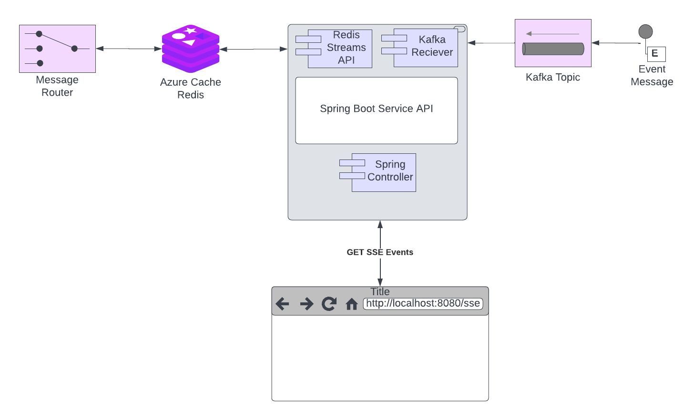

# Reactive Event Streaming Architecture with Kafka, Redis Streams, Spring Boot and HTTP Server-Sent Events (SSE)
This document outlines a solution for streaming events from Kafka, forwarding them to Redis using its Stream API, and reading individual streams from Redis via its streaming API. The added complexity in this scenario is the need to stream events from an HTTP endpoint using Server-Sent Events (SSE) while ensuring that only events relevant to a specific client ID are processed and sent.


## Problem Statement
We have an existing Kafka infrastructure where events are being produced. Our goal is to set up a system that subscribes to Kafka messages but only processes events relevant to a specific client ID. These filtered events should be forwarded to Redis using its Stream API. Additionally, we need to establish an HTTP endpoint for Server-Sent Events (SSE) that allows the specified client to receive real-time event updates.


## Solution Architecture Overview

The architecture consists of the following components:

1. **Kafka**: A distributed event streaming platform that allows you to publish and subscribe to streams of records (events).

2. **Spring Boot**: A framework for building Java applications. We'll use it to create Kafka consumers and Redis Stream producers.Subscribes to Kafka messages, filters events based on the client ID, and forwards relevant events to Redis Streams.

3. **Redis**: A high-performance, in-memory data store. We'll use its Streams feature to handle event streams.Stores the streamed events using its Streams API.

4. **Docker**: A containerization platform. We'll use Docker and Docker-Compose to create containers for Kafka, Redis, and our Spring Boot application.

5. **HTTP Server-Sent Events (SSE) Endpoint**: Provides real-time event updates to the client, filtering events based on the client ID.

```
flowchart TB
  subgraph Kafka
    K
  end

  subgraph Spring Boot Application
    B[[Kafka Reciever]]
    C[[Redis Stream API]]
    SSE[<u>Controller</u>]
  end

  subgraph Redis
    R[<u>Redis</u>]
  end

  subgraph HTTP Client
    HC[<u>HTTP Client</u>]
  end

  K --> |Events | B
  B --> C
  C --> R


  HC -->|HTTP GET| SSE
  SSE --> |SSE | HC
  SSE --> C

  ```




## Redis Streams 
Redis Streams is a feature in Redis that provides a way to handle real-time data streams with various use cases. Here are some scenarios where you might want to use Redis Streams:

**Real-Time Event Processing**: Redis Streams are excellent for processing and storing real-time events. You can use it for things like logging, monitoring, tracking user activities, or any use case that involves handling a continuous stream of events.

**Task Queues**: If you need a reliable and distributed task queue, Redis Streams can be a great choice. It allows you to push tasks into a stream and have multiple consumers process those tasks concurrently.

**Activity Feeds**: If you're building a social network or any application that requires activity feeds, Redis Streams can efficiently handle the feed data, ensuring fast access and scalability.

**Message Brokering**: Redis Streams can serve as a lightweight message broker for microservices or other distributed systems. It can handle message routing and ensure that messages are delivered to interested consumers.

**Real-Time Analytics**: When you need to analyze data in real-time, Redis Streams can be useful for storing the incoming data and then processing and aggregating it using Redis capabilities.

**IoT Data Ingestion**: If you're dealing with data from Internet of Things (IoT) devices, Redis Streams can handle the high-throughput and real-time nature of the data generated by these devices.

**Logging and Audit Trails**: Redis Streams can be used to store logs or audit trails in real-time, making it easy to analyze and troubleshoot issues.

**Stream Processing**: If you need to process a continuous stream of data in a specific order (for example, financial transactions or sensor readings), Redis Streams can help you manage the data in the order it was received.


## Prerequisites

- Docker and Docker Compose are installed.
- Basic understanding of Spring Boot, Redis Streams, and Kafka.
- Java 17 or higher
- An http client of your choice. I used [httpie](https://httpie.io/docs/cli/installation)

## Steps

### 1. Set Up Docker Compose for the backend infrastructure and the spring boot app

Create a `docker-compose.yml` file to define the services:

```yaml
version: '3.8'
services:
   zookeeper:
      image: confluentinc/cp-zookeeper:latest
      environment:
         ZOOKEEPER_CLIENT_PORT: 2181
         ZOOKEEPER_TICK_TIME: 2000
      ports:
         - 22181:2181

      networks:
         node_net:
            ipv4_address: 172.28.1.81

   kafka:
      image: confluentinc/cp-kafka:latest
      depends_on:
         - zookeeper
      ports:
         - 29092:29092
         - 9092:9092
         - 9093:9093
      environment:
         KAFKA_BROKER_ID: 1
         KAFKA_ZOOKEEPER_CONNECT: zookeeper:2181
         KAFKA_ADVERTISED_LISTENERS: PLAINTEXT://kafka:9092,PLAINTEXT_HOST://localhost:29092,,EXTERNAL://172.28.1.93:9093
         KAFKA_LISTENER_SECURITY_PROTOCOL_MAP: PLAINTEXT:PLAINTEXT,PLAINTEXT_HOST:PLAINTEXT,EXTERNAL:PLAINTEXT
         KAFKA_INTER_BROKER_LISTENER_NAME: PLAINTEXT
         KAFKA_OFFSETS_TOPIC_REPLICATION_FACTOR: 1

      networks:
         node_net:
            ipv4_address: 172.28.1.93

   cache:
      image: redis:6.2-alpine
      #image: redis:5.0.3-alpine
      restart: always
      ports:
         - '6379:6379'
      #command: redis-server --save 20 1 --loglevel warning --requirepass eYVX7EwVmmxKPCDmwMtyKVge8oLd2t81
      command: redis-server /usr/local/etc/redis/redis.conf --loglevel verbose --save 20 1
      volumes:
         - cache:/data
         - ./redis.conf:/usr/local/etc/redis/redis.conf
         - $PWD/redis-data:/var/lib/redis

         #environment:
         # - REDIS_REPLICATION_MODE=master

      networks:
         node_net:
            ipv4_address: 172.28.1.79

volumes:
   cache:
      driver: local

networks:
   node_net:
      ipam:
         driver: default
         config:
            - subnet: 172.28.0.0/16

```
Create the yaml for the application 'sse-demo.yml'
```yaml
version: "3.8"
services:
  sse-demo:
    image: "sse/spring-sse-demo:latest"
    ports:
      - "8080:8080"
      #- "51000-52000:51000-52000"

    env_file:
      - local.env

    environment:
      - REDIS_REPLICATION_MODE=master
      - SPRING_PROFILES_ACTIVE=default
      - REDIS_HOST=172.28.1.79
      - REDIS_PORT=6379
      - KAFKA_BOOTSTRAP_SERVERS=172.28.1.93:9093

    networks:
      node_net:
        ipv4_address: 172.28.1.12

networks:
  node_net:
    external:
      name: docker_node_net


```

### 2. Create Spring Boot Application

Create a Spring Boot application with the required dependencies:

```bash
git checkout https://github.com/glawson6/spring-sse-demo.git
```

In `pom.xml`, add the necessary dependencies for Kafka and Redis integration.

### 3. Implement Kafka Consumer and Redis Stream Producer

Create a Kafka consumer that listens to Kafka events and sends them to Redis Streams:

```java
package com.taptech.sse.event;


import com.fasterxml.jackson.core.JsonProcessingException;
import com.fasterxml.jackson.databind.ObjectMapper;
import com.taptech.sse.utils.DurationSupplier;
import com.taptech.sse.utils.ObjectMapperFactory;
import com.taptech.sse.config.SSEProperties;
import jakarta.annotation.PostConstruct;
import org.slf4j.Logger;
import org.slf4j.LoggerFactory;
import org.springframework.boot.context.event.ApplicationStartedEvent;
import org.springframework.context.event.EventListener;
import org.springframework.data.redis.connection.stream.*;
import org.springframework.data.redis.core.ReactiveStringRedisTemplate;
import reactor.core.Disposable;
import reactor.core.publisher.Flux;
import reactor.core.publisher.Mono;
import reactor.kafka.receiver.KafkaReceiver;
import reactor.kafka.receiver.ReceiverRecord;
import reactor.util.function.Tuple2;
import reactor.util.function.Tuples;
import reactor.util.retry.Retry;

import java.nio.ByteBuffer;
import java.time.Duration;
import java.time.LocalDateTime;
import java.time.temporal.ChronoUnit;
import java.util.function.Function;

public class DefaultEventReceiverService implements EventReceiverService {
	private static final Logger logger = LoggerFactory.getLogger(DefaultEventReceiverService.class);

	public final static String TEST_STREAM = "test.stream";
	public final static String TEST_STREAM_KEY = "test.stream.key";
	public final static String TEST_STREAM_VALUE = "test.stream.value";
	private static final String EMPTY_STR = "";
	public static final String CLIENT_STREAM_STARTED = "client.stream.started";
	public static final String HASH_PREFIX = "hash.";

	private static ObjectMapper objectMapper = ObjectMapperFactory.createObjectMapper(ObjectMapperFactory.Scope.SINGLETON);

	ReactiveStringRedisTemplate redisTemplate;
	KafkaReceiver<String, String> kafkaReceiver;
	SSEProperties sseProperties;
	StreamReadOptions streamReadOptions;

	public DefaultEventReceiverService(ReactiveStringRedisTemplate redisTemplate, KafkaReceiver<String, String> kafkaReceiver,
									   SSEProperties sseProperties) {
		this.redisTemplate = redisTemplate;
		this.kafkaReceiver = kafkaReceiver;
		this.sseProperties = sseProperties;
		this.streamReadOptions = StreamReadOptions.empty().autoAcknowledge()
				.block(Duration.of(sseProperties.getClientHoldSeconds(), ChronoUnit.SECONDS));
	}

	static final Function<String,String> calculateHashKey = str -> new StringBuilder(HASH_PREFIX).append(str).toString();

	@PostConstruct
	public void init() {

		this.redisTemplate.opsForValue().append(TEST_STREAM_KEY, TEST_STREAM_VALUE).subscribe();

	

	}

	@EventListener(ApplicationStartedEvent.class)
	public Disposable startKafkaConsumer() {
		logger.info("############# Starting Kafka listener.....");
		return kafkaReceiver.receive()
				.doOnError(error -> logger.error("Error receiving event, will retry", error))
				.retryWhen(Retry.fixedDelay(Long.MAX_VALUE, Duration.ofSeconds(sseProperties.getTopicRetryDelaySeconds())))
				.doOnNext(record -> logger.info("Received event: key {}", record.key()))
				.filterWhen(record -> checkIfStreamBeingAccessed(record))
				.concatMap(this::handleEvent)
				.subscribe(record -> record.receiverOffset().acknowledge());
	}

	Mono<Boolean> checkIfStreamBeingAccessed(ReceiverRecord<String,String> record){
		return this.redisTemplate.opsForHash().hasKey(calculateHashKey.apply(record.key()), CLIENT_STREAM_STARTED)
				.doOnNext(val -> logger.info("key => {}'s stream is being accessed {}",record.key(),val));
	}

	public Mono<ReceiverRecord<String, String>> handleEvent(ReceiverRecord<String, String> record) {
		return Mono.just(record)
				.flatMap(this::produce)
				.doOnError(ex -> logger.warn("Error processing event: key {}", record.key(), ex))
				.onErrorResume(ex -> Mono.empty())
				.doOnNext(rec -> logger.debug("Successfully processed event: key {}", record.key()))
				.then(Mono.just(record));
	}

	public Mono<Tuple2<RecordId, ReceiverRecord<String, String>>> produce(ReceiverRecord<String, String> recRecord) {

		ObjectRecord<String, String> record = StreamRecords.newRecord()
				.ofObject(recRecord.value())
				.withStreamKey(recRecord.key());
		return this.redisTemplate.opsForStream().add(record)
				.map(recId -> Tuples.of(recId, recRecord));
	}

	Function<ObjectRecord<String, String>, NotificationEvent> convertToNotificationEvent() {
		return (record) -> {
			NotificationEvent event = null;
			try {
				event = objectMapper.readValue(record.getValue(), NotificationEvent.class);
			} catch (JsonProcessingException e) {
				e.printStackTrace();
				event = new NotificationEvent();
			}
			return event;
		};
	}

	private Mono<String> createGroup(String workspaceId){
		return redisTemplate.getConnectionFactory().getReactiveConnection().streamCommands()
				.xGroupCreate(ByteBuffer.wrap(workspaceId.getBytes()), workspaceId, ReadOffset.from("0-0"), true)
				.doOnError((error) -> {
					if (logger.isDebugEnabled()){
						logger.debug("Could not create group.",error);
					}
				})
				.map(okStr -> workspaceId)
				.onErrorResume((error) -> Mono.just(workspaceId));
	}


	private Flux<NotificationEvent> findClientNotificationEvents(Consumer consumer, StreamOffset<String> streamOffset, DurationSupplier booleanSupplier){
		return this.redisTemplate.opsForStream().read(String.class, consumer, streamReadOptions, streamOffset)
				.map(convertToNotificationEvent())
				.repeat(booleanSupplier);
	}

	public Flux<NotificationEvent> consume(final String clientId){
		return Flux.from(createGroup(clientId))
				.flatMap(id -> addIdToStream(clientId))
				.map(id -> Tuples.of(StreamOffset.create(clientId, ReadOffset.lastConsumed()),
						Consumer.from(clientId, clientId),
						new DurationSupplier(Duration.of(sseProperties.getClientHoldSeconds(), ChronoUnit.SECONDS), LocalDateTime.now())))
				.flatMap(tuple3 -> findClientNotificationEvents(tuple3.getT2(), tuple3.getT1(), tuple3.getT3()));

	}

	private Mono<String> addIdToStream(String id) {
		return this.redisTemplate.opsForHash().put(calculateHashKey.apply(id), CLIENT_STREAM_STARTED, Boolean.TRUE.toString()).map(val -> id);
	}

	public Flux<Boolean> deleteWorkspaceStream(String workspaceId){
		StreamOffset<String> streamOffset = StreamOffset.create(workspaceId, ReadOffset.lastConsumed());
		StreamReadOptions streamReadOptions = StreamReadOptions.empty().noack();
		Consumer consumer = Consumer.from(workspaceId, workspaceId);

		return this.redisTemplate.opsForStream().read(String.class, consumer, streamReadOptions, streamOffset)
				.flatMap(objRecord -> this.redisTemplate.opsForStream().delete(workspaceId,objRecord.getId()).map(val -> objRecord))
				.flatMap(objRecord -> this.redisTemplate.opsForHash().delete(workspaceId));
	}

	@Override
	public Flux<String> consumeString(String clientId) {
		return this.redisTemplate.opsForStream().read(String.class, StreamOffset.latest(clientId)).map(ObjectRecord::getValue);
	}

}

```

### 4. Configure services in Spring Boot

Configure Redis Stream in the `application.properties` file:

```properties
cache.provider.name=redis
cache.host=${REDIS_HOST:localhost}
cache.port=${REDIS_PORT:6379}
cache.password=password


# Producer properties
spring.kafka.producer.bootstrap-servers=127.0.0.1:9092
spring.kafka.producer.key-serializer=org.apache.kafka.common.serialization.StringSerializer
spring.kafka.producer.value-serializer=org.apache.kafka.common.serialization.StringSerializer
spring.kafka.producer.group-id=group_id
spring.kafka.boostrap.servers=${KAFKA_BOOTSTRAP_SERVERS:loclahost:9093}


# Common Kafka Properties
auto.create.topics.enable=true
sse.client-hold-seconds=${SSE_CLIENT_HOLD_SECONDS:120}

logging.level.root=INFO
logging.level.com.taptech.sse=DEBUG

```

### 5. Build Docker Image for Spring Boot App

Using the `kubernetes-maven-plugin` from jkube, create the image for your Spring Boot application:

```shell
./mvnw clean package -Dmaven.test.skip=true k8s:build
```

### 6. Start the Services and Run the Application

From the src/test/resources/docker directory

Start the services:
```bash
./startServices.sh

```

Start the app:

```bash

./start-sse-demo.sh
```

### 7. Connect to a stream using one of the ids in client-ids.json file 
```shell
http --stream GET http://localhost:8080/sse clientId==dd07bd51-1ab0-4e69-a0ff-f625fa9e7fc0
```

### 8. Generate some Events
You can do an http POST to http://localhost:8080/sse/generateNE
```shell
http POST http://localhost:8080/sse/generateNE
```
After this watch as your http client recieves an event for the clientId that it is subscribed.

## Discussion
A decision was made to limit the events being pushed into redis based on wether there was a client actually 
expecting a message. If there were no clients then kafka messages were being filtered out.
```java
	.filterWhen(record -> checkIfStreamBeingAccessed(record))
```
The client registers the id so that the kafka listener will push the to redis stream. 
```java
.flatMap(id -> addIdToStream(clientId))
```

## Conclusion

By following the steps outlined in this document, we have successfully implemented an event streaming architecture that takes events from Kafka, filters them based on a specific client ID, and forwards the relevant events to Redis using its Stream API. The SSE endpoint allows clients to receive real-time event updates, tailored to their respective client IDs. This solution provides an efficient and scalable way to handle event streaming for targeted clients.